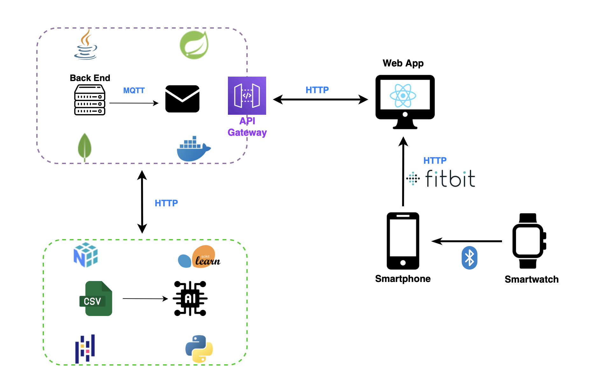

# wot-NeuroCare-Franza-Schito-MachineLearning

## Descrizione del progetto

Questo progetto si pone l’obiettivo di sviluppare una web app che possa offrire un supporto concreto nella gestione di queste patologie, mettendo a disposizione strumenti semplici ma efficaci per monitorare le abitudini quotidiane del paziente e rilevare eventuali cambiamenti significativi nel suo stile di vita. Il sistema si rivolge sia ai caregiver, che possono così avere un quadro più chiaro e aggiornato della situazione, sia ai medici, che possono accedere a dati utili per una valutazione clinica più approfondita.

Il progetto si è sviluppato su due fronti principali. Da una parte, è stato implementato un sistema di acquisizione dati basato su un sensore IoT, ovvero lo smatwatch Google Pixel, pensato per raccogliere in modo non invasivo informazioni rilevanti legate al comportamento e allo stato fisico del paziente. Dall’altra, è stata progettata una piattaforma accessibile via web, dotata di dashboard intuitive e personalizzate, in grado di restituire una visione sintetica ma dettagliata dell’andamento quotidiano.

## Architettura del sistema

  

Le componenti dell'architettura sono:
- **Front End - Javascript** 
- **Back End - Java** 
- **Machine Learning - Python** 
 
## Machine Learning

Per l’analisi dei dati, è stato implementato un algoritmo di classificazione basato su Random Forest, un modello supervisionato ampiamente utilizzato nel machine learning per la sua capacità di gestire dati rumorosi e altamente non lineari. È una tecnica che combina diversi alberi decisionali indipendenti tra loro per migliorare la capacità predittiva e la generalizzazione del modello complessivo.

## Preparazione dati

I dataset utilizzati per l’addestramento  e il test del modello di machine learning  sono stati generati ai fini del progetto, integrando al dataset di test alcuni dei dati raccolti  tramite lo smartwatch. Le tuple dei due dataset sono formate  da tre attributi:

- **Steps:** numero di passi totali effettuati in un giorno

- **Calories_Out**: stima delle calorie bruciate in un giorno

- **State**: etichetta di classificazione, che rappresenta lo stato fisico e comportamentale del paziente in un giorno.

## Il repository del Back End si trova al seguente link: [wot-project-2023-2024-NeuroCare-Franza-Schito-BackEnd](https://github.com/UniSalento-IDALab-IoTCourse-2023-2024/wot-project-2023-2024-NeuroCare-Franza-Schito-Backend.git)

## Il repository del Front End  si trova al seguente link: [wot-project-2023-2024-NeuroCare-Franza-Schito-FrontEnd](https://github.com/UniSalento-IDALab-IoTCourse-2023-2024/wot-project-2023-2024-NeuroCare-Franza-Schito-FrontEnd.git)

## Il sito web del progetto si trova al seguente link: [Sito Web](https://unisalento-idalab-iotcourse-2023-2024.github.io/wot-project-2023-2024-presentation-Franza-Schito-AndreaFr0.github.io/)
